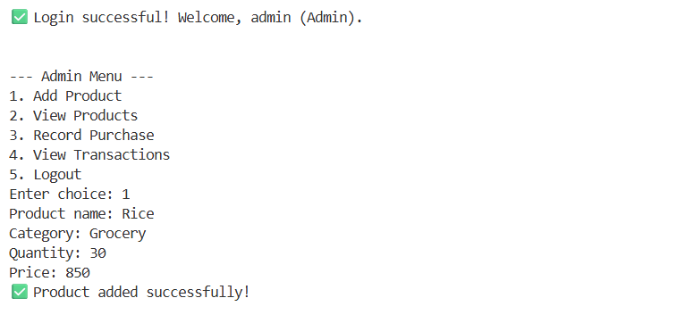

# Inventory Management System

## Overview
This is a command-line Inventory Management System built with Python and SQLite3. The application allows Admins and Customers to manage products, record purchases and sales, and view transaction history. It demonstrates database integration, CRUD operations, and user authentication.

---

## Features
- **User Authentication** (Admin/Customer roles)
- **Product Management**: Add and view products
- **Transaction Management**: Record purchases (Admin) and sales (Customer)
- **View Transactions**: Admins can view all, customers can view their own
- **Supplier Table**: Products can be linked to suppliers
- **Simple CLI Interface**

---

## Database Schema

- **User**
  - user_id (PK)
  - username (unique)
  - password
  - role (`Admin`, `Customer`, `Staff`)

- **Supplier**
  - supplier_id (PK)
  - name
  - contact_no
  - address

- **Product**
  - product_id (PK)
  - name
  - category
  - quantity
  - price
  - supplier_id (FK)

- **Transactions**
  - txn_id (PK)
  - product_id (FK)
  - user_id (FK)
  - txn_type (`Purchase`/`Sale`)
  - quantity
  - date

---

## Getting Started

### Prerequisites
- Python 3.x (https://www.python.org/downloads/)
- No external libraries required (uses built-in `sqlite3` and `getpass`)

### Setup
1. **Clone the repository**
    ```sh
    git clone https://github.com/yourusername/inventory-management.git
    cd inventory-management
    ```
2. **(Optional) Seed the database with sample data**
    ```sh
    python seed_data.py
    ```
3. **Run the application**
    ```sh
    python inventory_management.py
    ```

---

## Usage Guide

- **Login**
    - Default admin credentials:
        - Username: `admin`
        - Password: `admin123`
    - Customers can be added directly in the database or via seed script.

- **Admin Menu**
    1. Add Product
    2. View Products
    3. Record Purchase
    4. View Transactions
    5. Logout

- **Customer Menu**
    1. View Products
    2. Book Product (Sale)
    3. View My Transactions
    4. Logout

---

## Example Screenshots

### Admin - Add Product


### Customer - View Transactions


## Project Structure

```
|-- inventory_management.py   # Main application
|-- seed_data.py              # (Optional) Script to seed database
|-- inventory.db              # SQLite database (auto-created)
|-- README.md                 # Project documentation
```

---

## Notes
- Passwords are stored in plain text for demo purposes. For real applications, use password hashing.
- Input validation is basic; further improvements are possible.
- For any issues, raise an issue in the repository.

---

## Submission
- Ensure all code and documentation are committed to your GitHub repository.
- Include screenshots and/or a short demo video if required.
- Submit your repository link as instructed.

---

## License
MIT License
